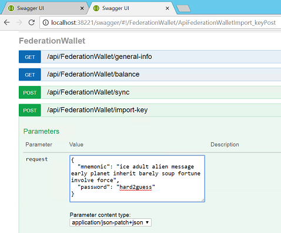
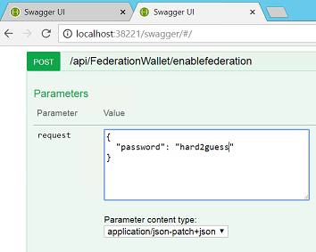

| Windows | MacOs | Ubuntu64
| :---- | :------ | :---- |
| [](https://stratisplatformuk.visualstudio.com/Enigma/_build/latest?definitionId=11) | [](https://stratisplatformuk.visualstudio.com/Enigma/_build/latest?definitionId=12) | [](https://stratisplatformuk.visualstudio.com/Enigma/_build/latest?definitionId=14)

Stratis Federated Sidechains - Testnet Alpha Release
============================
https://stratisplatform.com

Welcome to the Stratis Federated Sidechains Alpha.  This release introduces our Federated Gateway technology running a new sidechain, the Apex blockchain, on testnet. We also introduce newly extended wallet functionality that allows cross-chain transactions: Deposits and Withdrawals to and from the Sidechain.

In this alpha, advanced users can create their own new sidechain network, with their own coin, and fund it via with TSTRAT through their own federation. However, a great way to get started is to try our pre-setup Apex network which has everything you need to try out the end product.  You can setup two wallets, a Stratis Mainchain wallet and a Apex Sidechain wallet and perform cross-chain Deposits and Withdrawals.

## Setting up your Mainchain and Sidechain Wallets

In this section we will first setup a TSTRAT wallet and fund it with testnet STRAT from our faucet.  Then we will setup the sidechain TAPEX wallet.  We'll them enable these wallets for cross-chain transactions and perform a deposit and a withdrawal to and from the Apex Sidechain.

#### Cloning the code

1. Navigate to a folder on your computer. Such as a folder called 'Stratis.Sidechains'.
2. Clone the following repositories:

```
git clone http://github.com/stratisproject/federatedsidechains
git clone http://github.com/stratisproject/fullnodeui -b sidechains-ui
git clone http://github.com/stratisproject/stratisbitcoinfullnode
```

#### Running the blockchains

3. Create two folders for your sidechain and mainchain data.  Such as 'Mainchain' and 'Sidechain'.
4. Navigate to StratisBitcoinFullNode\src\Stratis.StratisD and start the full node as a normal stratis node.

```
dotnet run -testnet -datadir=<full path to Mainchain folder you created in Step 3>
```
5. Navigate to FederatedSidechains\src\Stratis.SidechainD and start the sidechain node.

```
dotnet run -testnet -datadir=<full path to Sidechain folder you created in Step 3>
```

#### Running the wallets

6. Navigate to FullNodeUI\FullNode.UI and issue the following commands.

```
npm install
npm run testnet
```

7. In a new console navigate again to FullNodeUI\FullNode.UI and issue the following command:

```
npm run testnet:sidechain
```

#### Funding your mainchain wallet

You now have a mainchain and a sidechain wallet running.  You can use the stratis testnet faucet, faucet.stratisplatform.com to get testnet coins for your wallet.  Send these coins to your TSTRAT wallet (get a receive address from the wallet receive functionality). Wait for the inbound transaction to confirm.

#### Enabling CrossChain Transactions

Once you have received your testnet coins we can enable the cross-chain transaction features in the mainchain wallet.  This can be done via the setting command.

#### Perform a Deposit to Sidechain

In this step we will perform a 'Deposit to Sidechain'.  This will send TSTRAT across to the sidechain.

Press the Cross-Chain command that is located next to the send and receive buttons on the TSTRAT mainchain wallet main page. Enter an amount, the federation address and the destination address where you want the newly received TAPEX to be received.

Mainchain Federation Address: 2N3UFTMd9ywUSqd12FkBPmYwEebxbGA8rQy  (if you are on the stratis Apex testnet).
Sidechain Destination Address: this is an address you can get from your TAPEX wallet by using the 'Receive' feature to generate the address.

For information, when you perform a cross-chain transfer such as a Deposit to Sidechain, you are infact not sending any coins across to the destination chain. Instead they are locked up on the mainchain by the federation who, in turn, releases the same amount of coins from a store they control on the sidechain. Therefore, a pair of transaction are performed that create the illusion of a cross-chain transaction.

Wait several minutes and the amount you sent will appear in your sidechain wallet.

#### Perform a Withdrawal from Sidechain

Repeat the procedure described for a deposit to perform the symmetrical withdrawal transaction from Apex back to Stratis.  The Sidechain Federation address for the Apex testnet network is: pFmbfn5PtgsEENzBKbsDTeS5vkc52bBftL. 

Congratulations you have funded your sidechain from the Stratis network.


## Running a sidechain gateway

In order to be a federation gateway member, you will need to be running two nodes with the _FederationGateway_ feature activated, one would be running on the mainchain network, and the other one on the sidechain network.
As a first step make sure you have prepared 2 configuration files, they should look like that, showing an port for the node's API, and a _counterchainapiport_ to connect to the node running on the other chain of the gateway, a list of IP addresses used within the federation, and a multisig redeem script (here we show a 2 of 3 multisig for instance) :

```sh
####Sidechain Federation Settings####
apiport=38226
counterchainapiport=38202
federationips=104.211.178.243,51.144.35.218,65.52.5.149
redeemscript=2 026ebcbf6bfe7ce1d957adbef8ab2b66c788656f35896a170257d6838bda70b95c 02a97b7d0fad7ea10f456311dcd496ae9293952d4c5f2ebdfc32624195fde14687 02e9d3cd0c2fa501957149ff9d21150f3901e6ece0e3fe3007f2372720c84e3ee1 3 OP_CHECKMULTISIG
publickey=02a97b7d0fad7ea10f456311dcd496ae9293952d4c5f2ebdfc32624195fde14687
# the next part is only needed when starting the federation node connected to the ApexNetwork
# it is used to specify that Federation will mine and put the reward in its Multisig wallet
mine=1
mineaddress=pFmbfn5PtgsEENzBKbsDTeS5vkc52bBftL
```

Then you will have to start two deamons and connect them, here is how you can do that :

#### sidechain deamon startup 
```sh
md %AppData%\Roaming\StratisNode\apex\Test\
copy apex.gateway.conf %AppData%\Roaming\StratisNode\apex\Test\
dotnet Stratis.FederationGatewayD.dll -sidechain -conf="apex.gateway.conf"
```
#### mainchain deamon startup 
```sh
md %AppData%\Roaming\StratisNode\apex\StratisTest\
copy stratis.gateway.conf %AppData%\Roaming\StratisNode\apex\StratisTest\
dotnet Stratis.FederationGatewayD.dll -mainchain -conf="stratis.gateway.conf"
```

### Enabling the multisig wallet

1) The first time you start your federation nodes, you will have to import your private keys to build the wallet file.
This can be done via the swagger API like this:



This first step is only needed the first time you start the node. 

2) The second step is to pass in your password to enable signing the transactions with the key previously imported key.
Once again you can do this using the swagger API.



You need to pass in the same password as in the above step, which is used to encrypt you imported key.
This step will be needed everytime you restart the node

_Tip: it is important that you go through this process for the 2 nodes your federation gateway is running. The default addresses for the APIs are_
* http://localhost:38221/swagger/#/
* http://localhost:38201/swagger/#/

You should now be ready to go!
