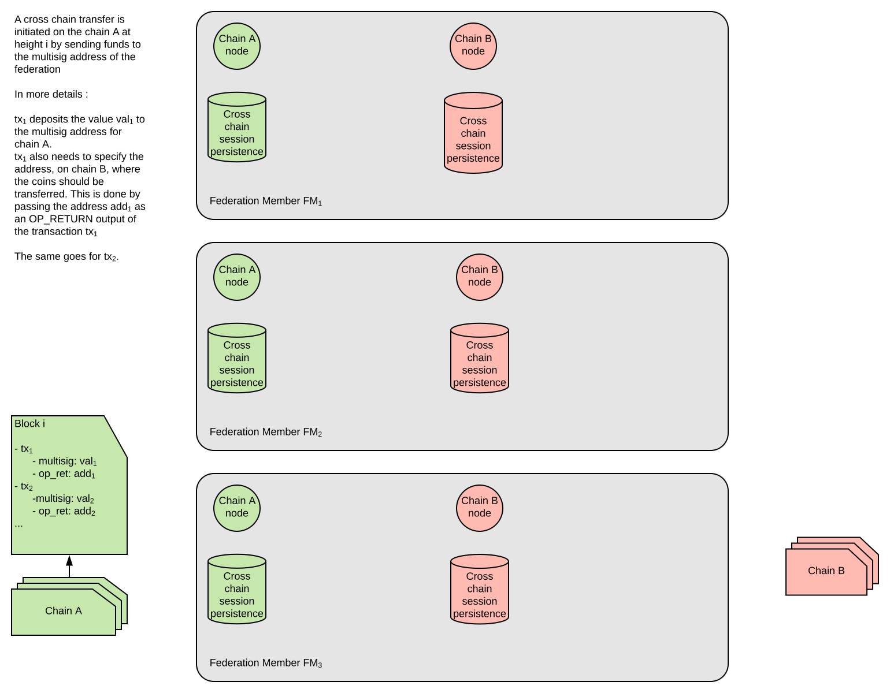
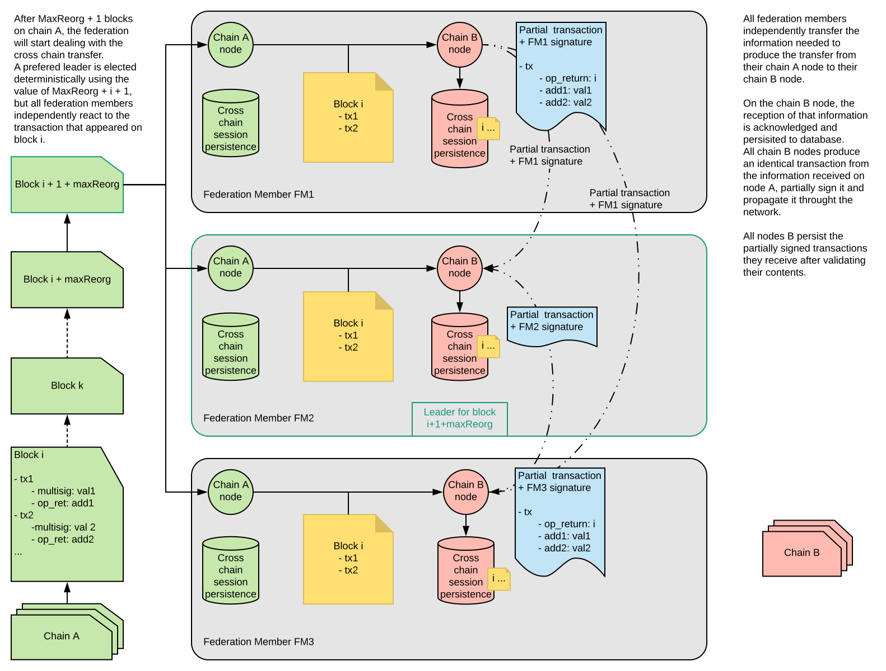
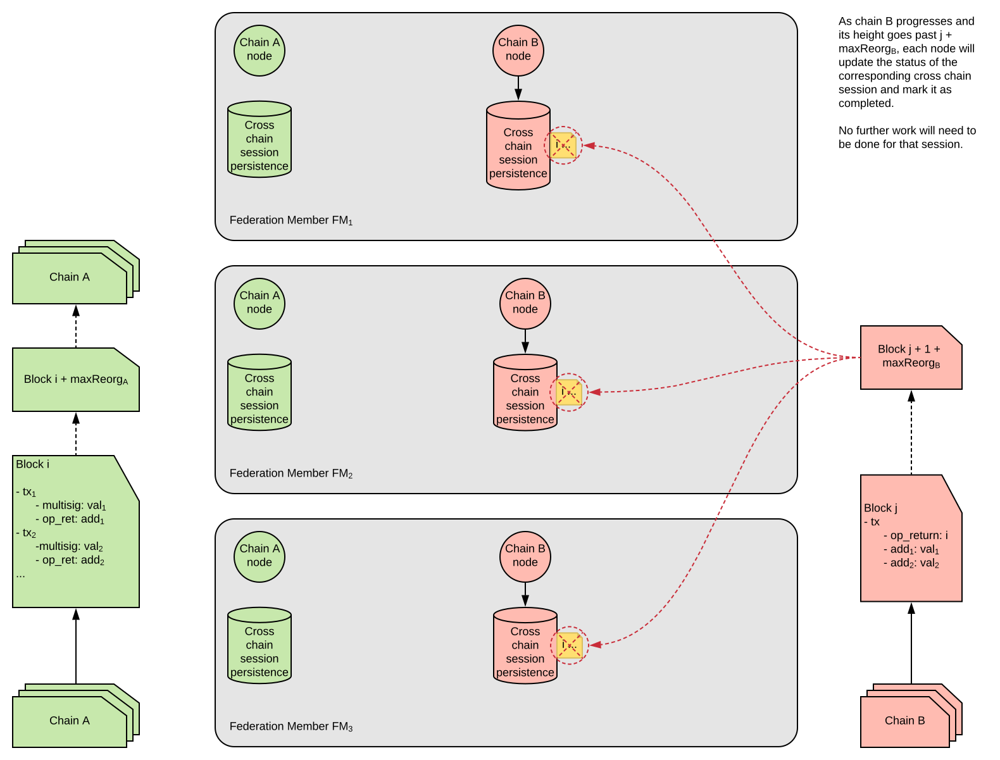
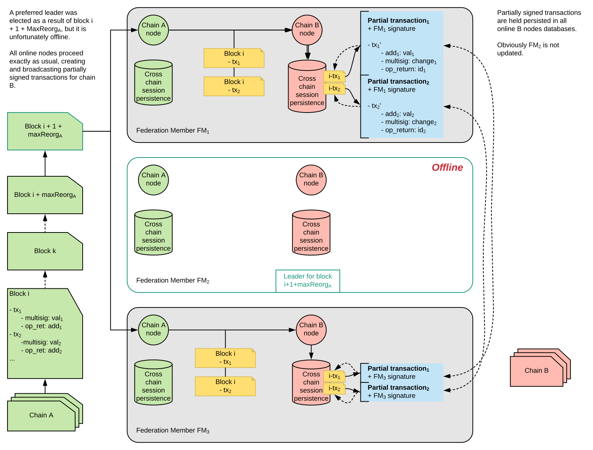
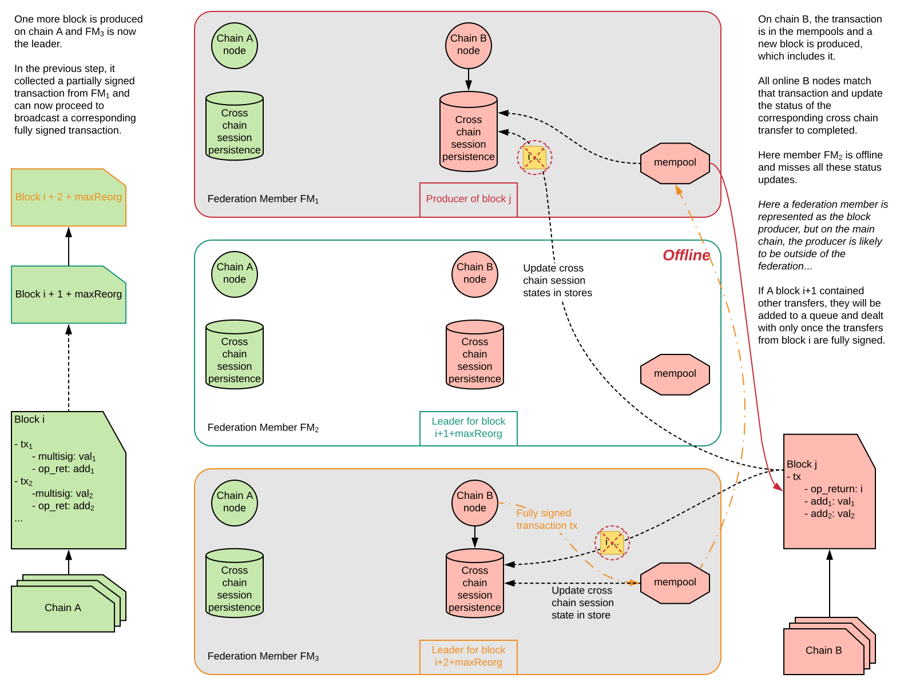
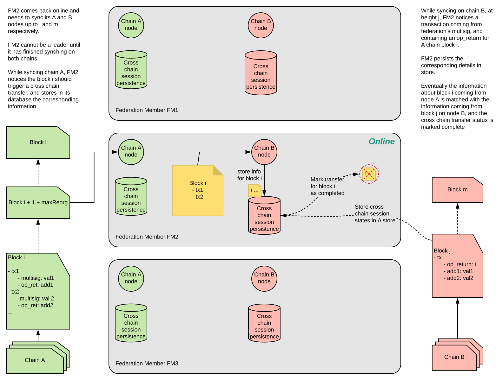
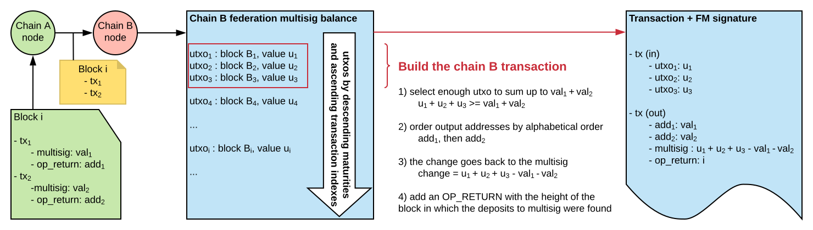

# Suggestion for Cross Chain transfers mechanism

### Overview

Coordinating transfer between two chains requires a federation of members to work together in order to achieve enough signatures to release funds from the federation's multisig.
We propose a deterministic approach to generating such transactions, and to select the leader that will coordinate the transfer process.
We assume that the federation members are able to connect to each other, and broadcast messages between themselves.

Various scenarios around these interactions between users and federation members are described below.

## 1) All federation members nodes online

### A cross chain transfer is initiated

Some users of chain A decide to transfer funds to chain B. To achieve this, they each create a deposit to the multisig address of the federation on chain A. These deposit transactions are notated tx1, tx2, ... txN. Now they will need to wait for their deposit transactions to be buried under enough blocks (corresponding to the chain's maximum reorg length parameter, if this is in use) before the transfer mechanism of the federation is triggered.

### The cross chain transfer is triggered after chain A's maximum reorg length

When the maximum reorg length is passed and the deposit transactions cannot be reverted, the federation members start to proceed with the transfers. A leader for that block's transfers is elected deterministically based on the block height in which the deposit transactions were confirmed on chain A, but each node still performs the same operations independently.

Before the leader can process the transactions in the current block, they must first look into previous blocks and detect if there were any unprocessed transfers. It is important to note that a transfer cannot happen until all previous transfers have been processed successfully, this means a leader is also responsible for blocks belonging to other members in case they were offline.  

Each node transfers the details of the deposit transactions made on chain A (block height, target addresses and corresponding amounts to transfer), then persists those details in its database.
From that point, each node has enough information to create partially signed transactions and propagate them to the other members of the federation. Each node will also persist the partially signed transactions they receive and collect signatures (this is in case they become the leader of an unprocessed transfer and can immediately broadcast it), but only the leader will proceed to broadcasting a fully signed transaction.

### The cross chain transfer appears on targeted chain

Once the leader has collected enough signatures, they can broadcast a fully signed transaction to the network and it will appear in the mempool of all the other nodes. This transaction will then be persisted in a future block (usually the very next one) of the chain B network.
After that, each federation member monitoring chain B will match the transaction found on the chain by its inputs, outputs (including the OP_RETURN), and update the status of the transfer.

### The cross chain transfer passes chain B's maximum reorg length

Finally, as chain B progresses and the transfer's maturity passes the maximum reorg length, all federation nodes monitoring the B chain can update the status of the corresponding session in their respective stores. Once the status of the session is marked complete, no more work will be required for this session.

## 2) Preferred leader offline

### A cross chain transfer is triggered while leader is offline

Similar to the previous case, deposit transactions to the federation's multisig on chain A have triggered a cross chain transfer. Here however, the preferred leader happens to be offline. All other nodes carry on as usual, creating and exchanging partially signed transactions. However, no one is here to broadcast it as FM2 is offline.

### The cross chain is handled one block later by next leader

As time passes, a new block appears on chain A, and a new leader is elected (FM3). This new leader can now broadcast the transaction and we are back on the normal path (cf 1.).

As described earlier, every new leader must first check for previously unprocessed transfers and process those first, before attending to the transfers on the current block. If a few leaders are offline, this can create a backlog of transfers.
If a leader finds a previously unprocessed transfer (and they don't have enough signatures to broadcast) they must do nothing and wait for the other members to send over signatures.
If not enough members are online to reach the minimum number of signatures required by the multisig, then transfers will halt untill enough members come back online and re-broadcast signatures.

### The leader comes back online

When the leader comes back online, they will retrieve from their store the last known block heights which they had processed transfers for, and resync their store from there while synching up the chain A & chain B nodes.  
Partial transactions will then be added to the store and updated (or potentially completed) depending on their status on the chain B.  
The node will only be able to participate in cross chain transfers when it is fully synced again, and has the correct view of the multisig utxos set.  

A leader that is now synced and observing unprocessed previous transfers will start creating signatures for those transfers and broadcasting them to the other federation members.

## 3) Building the chain B transaction deterministically

There are two main reasons for building transactions deterministically.
1. To allow each member to independently build the exact same transaction, and therefore ensure that the federation members will never need to sign a UTXO more than once. This is for security reasons, as it negates the possibility that multiple transfers get made for a single deposit transaction.
2. To simplify the process of sharing signatures. A non-deterministic approach means a leader needs to create a session for the transfer, distribute it to the peer members, and then coordinate with the peers to sign it.

Assuming members are synced and have the same view of the multisig address (the collection of UTXOs), then by using a predefined algorithm every member can generate the transfer transaction. They can then sign it with their key and broadcast to the other members. It is possibly sufficient to only broadcast to the current leader, presuming they are online at the time.
It may be that in order to use a multisig UTXO the algorithm will require it to be buried under enough blocks, to avoid reorgs and ensure that all member have the same view of the UTXO list.

**The algorithm to select UTXOs for a transfer:**

- The oldest UTXO (determined by block height) is selected first.
- If a block has more than one UTXO, then they are selected in order of appearance in the block transaction list.
- If multiple UTXOs appear within a transaction then they are selected in ascending index order.
- Dusty UTXOs are ignored (below 100 Strats ?).
- When change is non null and below dust level (100 Strats ?), the next UTXOs needed to build up a change value above that level are selected.

**The structure of the inputs of the transaction:**

- UTXOs appear as transaction inputs in age order (per the selection algorithm described).
- Sufficient UTXOs are selected to cover the value of the outputs.

**The structure of the outputs of the transaction:**

- Outputs, if more than one is required, are sorted by destination address (i.e. the scriptPubKey).
- The output returning change back to the multisig, if any, appears after the value transfer output(s).
- An OP_RETURN output containing the hash of the block on the originating chain (i.e. the block the deposit transactions appear in).

A member that comes back online after a long period will need to sync both chains and also build the database of transfer transactions, they should be able to do this simply by looking at the chains themselves.  
A member that comes back online will, once it is done syncing both its chains and has the correct views of the multisig UTXO lists, check all the unprocessed transfers, start building and signing corresponding transactions, and broadcast them to its peers. 

**The algorithm to select the leader:**

The leader role will be assigned round-robin to each member in turn, following the order they are defined in the setup. It is not considered to be necessary to introduce the complexity of a pseudorandom-assignment methodology such as the block hash.

## Considerations ## 

1. What is the fee going to be on the transfer trx (to maintain determinism)?
2. What if a block is full of transfer transactions (too full for the other chain)?
3. What if all members are offline how do we handle resync of federation members?
4. If a member comes online as the current leader, without having been present for a previous unprocessed block, they will need to get signatures from the other members for that previous block. This implies the need for some form of rebroadcast mechanism, presumably initiated by the current leader.
5. If the maturity of a UTXO has to be considered (i.e. due to the possibility of reorgs), then there is a bootstrapping issue when the network is first initialised. The premine is a single UTXO, and would have to be split in order for the chain to have adequate UTXO bandwidth. This splitting would have to be done on a continuous basis to preserve a pool of available UTXOs of appropriate sizes. These sizes are difficult to anticipate in advance as they would depend on the particular sidechain.
6. In general there is a UTXO bandwidth issue due to the ancestor transaction limit in a block. In other words, per UTXO per block, there are a finite number of transactions that could potentially be constructed from it, no matter what value the UTXO itself has.
7. The described design implies that deposits requested will be processed in batches in transfer transactions with multiple outputs. Thus the block hash of the originating block is stored in the OP_RETURN output of the transfer transaction. However, due to various scenarios where not all the transactions in a block can be processed (due to size or other reasons) this implies that multiple transfer transactions could have the same OP_RETURN contents.
8. What can cause a member to generate a multisig that is different for the rest of the federation (i.e. break determinism)?

### Handling deposits per block vs handling deposits per transactions

**Per Block pros**

- less transactions on the network, only true when multiple deposits to the multisig are present in the same block.

**Per Transactoin pros**

- Consideration 2 and 7 are dealt with  
    2 is unlikely to happen because we would have to create a single transaction too big for target block size.  
    7 does not happen as each deposit to multisig can be tracked by its transaction hash.
- As transactions are dealt with individually, when chains have different maximum size and frequency for producing blocks, it is not possible for a user to try and stop some transfers by bloating a given block with many small ones (enough to make the block too big for target chain). We also need to impose a minimum transfer fee to prevent that from happening anyway (simply imposing a high value is not enough as you can transfer to your own addresses and back).
- Cf. Above, ability to refund transaction under a certain amount, but keeping a punishment fee for it.